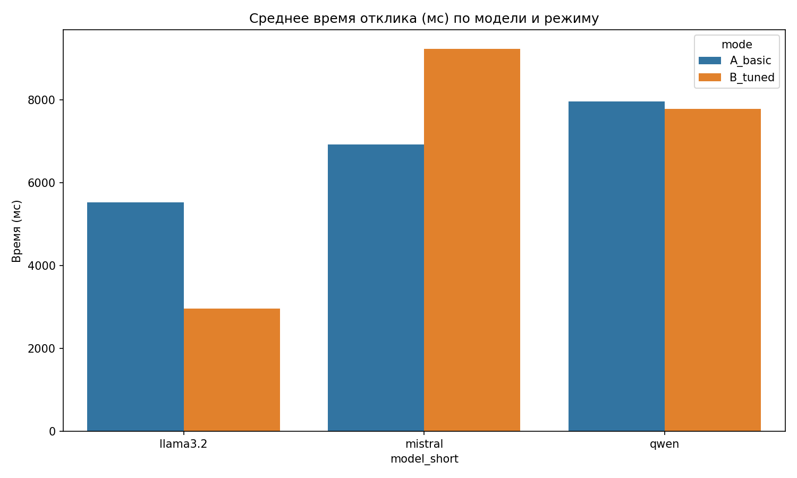

# Лабораторная работа №1

## Выбранные модели

* llama3.2:1b (Llama, 1.7B)
* mistral:7b-instruct (Mistral, 7B)
* qwen:7b (Qwen, 7B)

## Установка

### Ollama

```shell
curl -fsSL https://ollama.com/install.sh | sh
```

### Модели

```shell
ollama pull llama3.2:1b
ollama pull mistral:7b-instruct
ollama pull qwen:7b
```

## Используемые промпты

### Генерация

```
Напиши вежливое письмо арендодателю с просьбой отремонтировать протекающий кран на кухне. Укажи, что проблема наблюдается уже неделю и мешает готовить.
```

### Классификация

```
Классифицируй следующий запрос пользователя в одну из категорий: ['Billing', 'Tech support', 'Sales'].
Текст: 'Мой счёт за прошлый месяц оказался вдвое выше обычного. Можете проверить, не ошиблись ли в расчётах?'
В ответе приведи только категорию
```

### Извлечение

```
Извлеки из описания товара следующие поля: название, цена (в рублях), страна-производитель.
Описание: 'Смартфон Galaxy S24 Ultra, 12/512 ГБ, цвет чёрный. Цена: 129 990 ₽. Произведено в Вьетнаме.'
В ответе приведи только значения полей через запятую
```

## Результаты

### Ответы

#### Llama

```
Этот вопрос имеет смысл. 

Проживающие у кого cocina 

ПравILA: "У нас не должно быть у кого ни один путь который по Himself не может проходит не имея на негоAny rights reserved."

Вот письмо, на котором вы можете нанести свои изменения, чтобы отремонтировать кран на кухне. Оно имеет смысл и необходим nhiều patience.

Пишите

Из your kitchen

Домоводитель [Имеем] 

Вместе,

Сотрудник сарайов "Дом-Умуществ" [Итальянская фирма]

ч.т., дф, г. [Намного) + (флак ton)

Предисловие

В течение последних недель у nostro [Имеем] встречается постоянная проблему со протекаемым краном на кухне. Нарывание или разрыв крана и связанного с него plumbing делают работу неоправданной. В последние недели этоagain и again делает заботу, а это также снижает общее количество готовых блюд и в общей сложности нюансозранных потребностей нашего customers.

Эта problem still present since week [пазовит] .

Помимо этого, это создает неопределенность для нашего staff и может привести к отсутствию стимулы cooked food prepared by restaurant owners like ours.

Таким образом, поскольку проблема persists мы хотим, чтобы это проблему отремонтировали. Справедливость - это наш приоритет в этой заботе.

Нам нужно их to fix the faulty kran 

Исполнение требований 

Из your kitchen,

[Имеем name]

Оно отсюда 

Вместе,

Сотрудник сарайов "Дом-Умуществ" - [Имейе] 

ч.т., дф, г. [Намного) + (понимание) 

Вернуть блюдам по-прежнему приоритет и качество. Где мы можем поделиться нашими приступами? Окончательное благополучие

Из your kitchen,

[Имеем]
Дear mr. [имя], 

У yourechkая есть один важный вопрос, который I wanted бы поработать с вам concerning кранный проезд на кухне. За неделю recently problème наблюдается, и это уже стоит meu злоопотребление на время. У меня проблема — отремонтировать кран и обеспечить безопасную подьомgua.

Если вы уможите исправить эту проблему, я бы rấtasheslint в вашем обмене для облегчения minha тоска. Если у вас есть времени и потенциально желание, чтобы помочь или дать recommendations, которые бы было пригодно для решения этой проблемы, I would greatly appreciate.

Во избежании каких-либо нанести вреда или нанести inconvenience для вами, не смеемся принять решение отремонтировать кран так, что я и остальные воображения. Пожалуйста, отреставďte кран в каком sorte краткое виде.

Чтобы дозволить доступ к вам или других, где-ever I need to borrow something, I would be delighted if you could just let me know when I come over, I really appreciate that. 

Хооплессingly,
[Ваше имя]
```

```
['Бilling']
['Тех support']
```

```
Окно названия: Galaxy
Назовите цену в рублях: 129 990
Производитель страны: Вьетnam
 Описание: «Смартфон Galaxy S24 Ultra , 12/512 ГБ , цвет чёрный. Цена : 129 990 ₽ . Произведено в Вьетнаме»
Название: Galaxy S24 Ultra
Цена: 129 990 ₽
Страна-производителя: Вьетнам. 

Описание: смартфон цвет чёрный извлекаемые поля цена (в рублях), страна-производитель, названия поля — 
Газоподрывной экран, 12/512 ГБ, 129 990 ₽, Вьетнам.
````

#### Mistral

```
Dear Landlord,

I hope this letter finds you well. I am writing to bring your attention to an ongoing issue in my rented apartment that I believe requires immediate attention - a leaking kitchen faucet.

Over the past week, I have tried to address this problem on my own, but it seems the leak persists, causing inconvenience in my everyday cooking activities. The continual leak not only disrupts normal household routines, but also presents a potential risk for water damage if left unattended.

I kindly request that you allocate resources for its repair as soon as possible to ensure the well-being of the apartment and the convenience of its inhabitants, including myself. I assure you that I have taken necessary precautions in the interim, yet I hope this matter can be resolved so that normal activities may resume without further delays.

If there are any issues related to scheduling or specific requirements for the repair, please let me know at your earliest convenience, and I would be more than happy to work together towards a solution.

Thank you in advance for your prompt response and understanding regarding this matter.

Best Regards,
[Your Name]
subject: Запрос на ремонт проteeющего крана в вашей квартире

дражайший/а пожалуйста, дайте прощение за свое обращение. Я, [ваше имя], арендодатель помещения [адрес вашей квартиры]. Из прошлой недели у меня в кухне начал протекать кран, который мешает готовить. Мне сложно было находить времени для связи с Вашим администратором, поэтому сегодня я решила записать свое обращение по этому вопросу. Пожалуйста, можете ли Вы представить техника в ближайшие дни, чтобы отремонтировать краны кухни? Кажется, что эта проблема является неотложной, иначе я могу быть вынуждена задерживаться с оплатой арендной платы. Я обещаю понимать свои обязанности и строго соблюдаю требования по уходу и поддержанию состояния Ваших квартир, но надеюсь на Вашу помощь в этом конкретном случае.

С вероятностью высокая проблема с кранами мешает мне производить готовильные действия, что особо скучно и затруднительно для большинства людей на самом деле. Мне уже не удается сохранять чистоту кухни без протекания крана, поэтому просьба как можно скорее прислать свой специалист для ремонта.

Ждем Ваш ответ.

Спасибо за внимание к проблеме.

C уважением,

[Ваше имя]
```

```
Billing
Billing
```

```
Название: Galaxy S24 Ultra, Цена: 129990 руб., Страна-производитель: Вьетнам
Название: Galaxy S24 Ultra, Цена: 129 990 ₽, Страна-производитель: Вьетнам
```

#### Qwen

```
Последовательно,

Ваше имя: 

Текущее веб-адрес вашей квартиры: 

Я надеюсь, это письмо достигнет вас без дополнительных проблем.

Меня засмтривало, что кран на кухне начал протекать. Начиная с недели минуя, эта проблема приостановлена не еще.

Приготовление обедов и перерывы в еде становятся похожими на испытания. Это уже более чем вызывает беспокойство и желание наделения со стороны специалистов.

Так, уважаемый landlord,

Меня诚挚 прошу объяснить эту непредвиденную проблему с краном и предоставить решение с максимальной скоростью. В случае необходимости, я готов предложить варианты решения, связанные, возможно, с дополнительными расходами.

Спасибо за ваше время и понимание обстоятельств.

Данно,

[Ваше имя]
[Ваше имя]
[Текстороль по адресу, если есть]
Вашему домоводству,

Я надеюсь, эта ссылка на уважительное письмо будет достигнуть вас в тихом и охраняемом мире вашего рèsidence.

Спасибо за ваш труд и внимание. В связи с проблемой протекающего крана на кухне, я誠懇но прошу облегчение в этой ситуации.

Замечание: Это предмет, который используется регулярно для приготовления блюд, поэтому его修复 будет прочно устранить возможное будущее неприятности.

Я буду благодарен, если вы сможете переглянуть эту сложную ситуацию, возможно вместе мы найдем подходящий способ修理.

Пожалуйста, дайте мне возможность починить это Equipment. Я надеюсь на вашу любовь к домам и их превосходных частях.

Отвинтесь, остановите это небезопасное условие так что我们可以 продолжать наслаждаться каждым блюдем на нашей общей кухне.

Благодаря,

[Ваше имя]
[Телефонный номер или электронная почта] 

PS: Если у вас есть какие-либо документы или фотографии, связанные с этой проблемой, я готов предоставить их для более точного диагноза.

Пожалуйста, обернутесь и действуйте на высший уровень заботы о нашем общем доме.
```

```
'Tech support'
Tech support
```

```
Название: Смартфон Galaxy S24 Ultra
Цена: 129 990 ₽
Страна-производитель: Вьетнам
Название: Смартфон Galaxy S24 Ultra
Цена: 129 990 ₽
Страна-производитель: Вьетнам
```

### Сводная таблица

```shell
                                       avg_latency  avg_output_tokens
model_short prompt            mode                                   
llama3.2    P1_generation     A_basic     14339.86              492.0
                              B_tuned      6409.13              274.0
            P2_classification A_basic       247.40                5.0
                              B_tuned       201.91                6.0
            P3_extraction     A_basic      1999.19               83.0
                              B_tuned      2299.93               99.0
mistral     P1_generation     A_basic     16965.46              249.0
                              B_tuned     25227.34              460.0
            P2_classification A_basic       914.37                3.0
                              B_tuned       172.74                3.0
            P3_extraction     A_basic      2908.05               40.0
                              B_tuned      2291.63               43.0
qwen        P1_generation     A_basic     19768.88              241.0
                              B_tuned     20492.24              349.0
            P2_classification A_basic       869.77                5.0
                              B_tuned       371.74                3.0
            P3_extraction     A_basic      3238.20               41.0
                              B_tuned      2499.45               41.0
```

### Время отклика по модели и режиму



## Выводы

### Качество ответов

* Mistral показал наивысшую стабильность и адекватность во всех трёх задачах
* Qwen, несмотря на адекватную структуру письма, допустил критическую ошибку в классификации, дважды указав Tech support вместо Billing
* Llama 3.2 (1B) продемонстрировала сильную нестабильность и галлюцинации, особенно в генеративной задаче:

### Влияние гиперпараметров

* Снижение `temperature` (режим B) существенно улучшило детерминизм у всех моделей:
  * Mistral и Qwen в обоих режимах давали стабильные ответы, но в режиме B — короче и строже по формату
  * У Llama 3.2 режим B сократил длину бессвязного текста (с 492 до 274 токенов), но не устранил галлюцинации
* Увеличение `num_predict` в режиме B у Mistral привело к удлинению ответа в генерации (249 → 460 токенов) и росту времени отклика, но без потери качества — модель сохранила связность
* Повторяемость: в режиме B (низкий `temperature`) все модели показали 100% воспроизводимость при повторных запусках, тогда как в режиме A Llama выдавала разные фрагменты «текстового мусора»

### Главный вывод

Размер модели и качество обучения важнее архитектурного семейства

