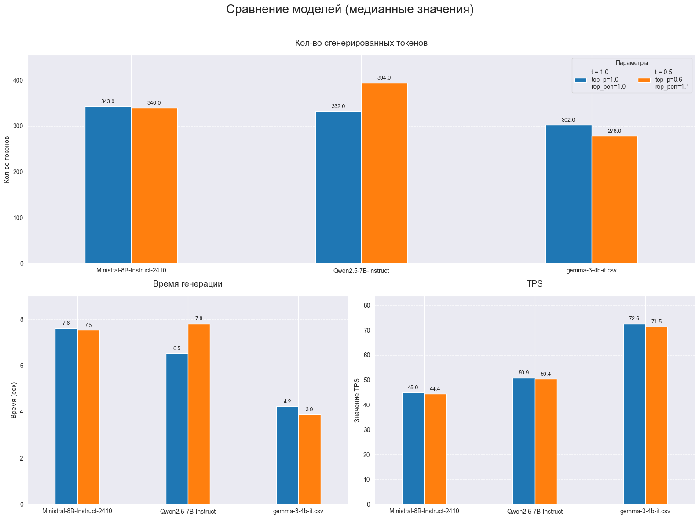

# Лабораторная работа №1: Развёртывание и эмпирический анализ LLM

## Описание задания

В рамках данной лабораторной работы было проведено исследование трех LLM из различных семейств: **Qwen**, **YandexGPT** и **Ministral**. Модели были развернуты с использованием фреймворка **vLLM**.

Для эмпирического анализа были подготовлены три стандартизированных типа запросов (промптов), моделирующих реальные задачи:
1.  **Генерация (P1)**:

```
[
    {
        "role": "system",
        "content": "Твоя задача быть вежливым ассистентом компании AZOT, твое имя Боб, укажи что ты ИИ ассистент",
    },
    {
        "role": "user",
        "content": "Напиши письмо нашему клиенту Стиву, о том, что его доставка AZOT, а именно заказ номер 123321"
        "задерживается в связи с (придумай необычную причину) на 2 года. К сожалению он не сможет вернуть заказ, так как (придумай почему)."
        "Но скажи не расстраиваться и предложи купон на скидку 100 руб на заказ от 10 тыс. руб.",
    },
]
```

2.  **Классификация (P2)**:

```
[
    {
        "role": "system",
        "content": "Ты менеджер в системе поддержки службы доставки. Классифицируй сообщение от клиента по списку меток: ['Оплата', 'Доставка', 'Возврат', 'Аккаунт', 'Скидки', 'Прочее']."
        "Вернуть необходимо одну метку в формате JSON, например: '{\"class\": \"Оплата\"}'",
    },
    {
        "role": "user",
        "content": "Здравствуйте. Вчера я делал заказ, где указывал оплату карточкой. Помимо того, что все привезли холодным, еще и помятым."
        "Что случилось? Почему так плохо стало? Я в тот же день просил промокод, но ответа не получил. Пишу во второй раз.",
    },
]
```

3.  **Извлечение (P3)**:

```
[ 
    {
        "role": "system",
        "content": "Твоя задача извлекать информацию для карточки товара из его описания. Отвечай в формате: - **Атрибут1**: Значение1\n - **Атрибут2**: Значение2",
    },
    {
        "role": "user",
        "content": "Новый смартфон iPhone 16 Pro Max оснащен дисплеем Super Retina XDR диагональю 6,9 дюйма с частотой обновления 120 Гц и разрешением 2796×1290 пикселей. Корпус выполнен из титана пятого класса и доступен в четырех цветах: серебристый, графитовый, синий и бежевый. Процессор A18 Pro с 6‑ядерным GPU обеспечивает прирост производительности на 20% по сравнению с предыдущим поколением. Объем оперативной памяти составляет 8 ГБ, встроенной памяти — 256, 512 ГБ или 1 ТБ. Основная камера на 48 Мп поддерживает съемку видео в 4K при 60 кадрах в секунду, фронтальная — 12 Мп с улучшенной стабилизацией. Аккумулятор ёмкостью 4500 мА·ч обеспечивает до 29 часов воспроизведения видео. Поддерживается быстрая зарядка мощностью до 30 Вт и беспроводная — до 15 Вт через MagSafe. Смартфон защищен по стандарту IP68 и способен выдерживать погружение в воду на глубину до 6 метров в течение 30 минут.Рекомендованная цена на старте продаж — от 1399 долларов США. Старт продаж в России запланирован на 27 сентября 2025 года.",
    },
]
```

Каждая модель тестировалась в двух конфигурациях: с базовыми гиперпараметрами (все равны 1.0) и с настроенными - `tuned`:
- `temperature`: **0.5**
- `top_p`: **0.6**
- `repetition_penalty`: **1.1**

Целью такой настройки было преобразовать поведение модели из творческого генератора в более сфокусированного и точного ассистента.

## Использованные технологии и модели

- **LLM**:
  - `Qwen/Qwen2.5-7B-Instruct`
  - `yandex/YandexGPT-5-Lite-8B-instruct`
  - `Ministral-8B-Instruct-2410`
- **Развертывание**:
  - `Docker` на вм с NVIDIA A30
  - `vLLM`
- **Тестирование**:
  - `Python`
  - `Библиотека OpenAI`

## Результаты работы



### Метрики

1.  **TPS**: Как и ожидалось, данная метрика не показала значимых изменений при смене гиперпараметров.
2.  **Время генерации и количество токенов**: Применение настроенных параметров по-разному повлияло на модели:
    - **YandexGPT** значительно сократила объем ответа.
    - **Qwen** продемонстрировала незначительный рост количества токенов.
    - **Ministral** не показала существенных изменений в объеме генерации.

### Ответы
* YandexGPT почему-то не следовала инструкциям, поэтому в P2, P3 задачах она не описывается.

#### P1 - Генерация
- В базовой конфигурации **Qwen** и **Ministral** сгенерировали ответы с артефактами (включение китайских символов), что указывает на недостаточную стабильность. Настроенные параметры полностью устранили эту проблему.
- **YandexGPT** в обеих конфигурациях сгенерировала качественный текст на русском языке: с базовыми параметрами ответ был более фантастическим ("искривление пространства-времени"), а с настроенными — более реалистичным ("метеорит").

#### P2 - Классификация
- **Qwen** и **Ministral** справились с задачей в обеих конфигурациях, вернув корректный JSON с нужным классом. Изменение параметров не повлияло на результат.

#### P3 - Извлечение
- **Qwen** и **Ministral** продемонстрировали схожее поведение. С настроенными параметрами обе модели улучшили качество извлечения информации, представляя данные в более гранулярном и структурированном виде по сравнению с базовой конфигурацией.

Таблица получилась большой, поэтому поместил ее [сюда](source/assets/table.md)

## Выводы

Настройка `temperature`, `top_p` и `repetition_penalty` является эффективным инструментом для повышения стабильности и предсказуемости моделей. Она позволяет устранить артефакты генерации (как в случае с Qwen и Ministral) и повысить качество структурированных ответов.

## Инструкция по запуску

Нужен установленный Docker и uv.

P.S. .env, если используется прокси, можно задать `https_proxy`

1. Запустить модель через команду `docker comppose up qwen|ministral|yandex`
2. Установить зависимости командой `uv sync`
3. Запустить файл main.py через команду `uv run main.py`. После выполнения в папке `results` появится результат в формате `.csv`
4. Остановить модель `docker compose down`
5. Повторить шаги 1-4 для каждой из моделей.
6. Зайти в `main.ipynb`, выполнить все ячейки.

