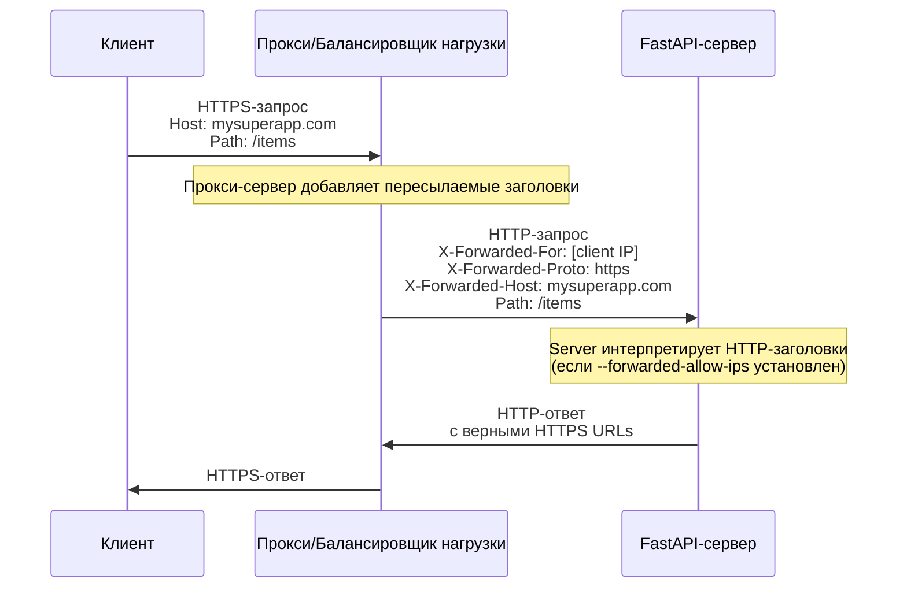
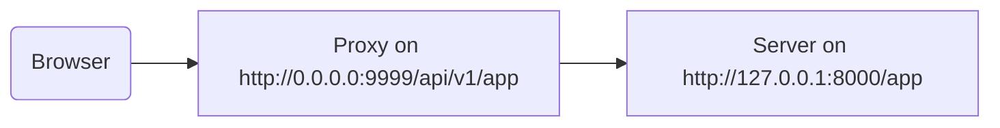

# За прокси‑сервером { #behind-a-proxy }

Во многих случаях перед приложением FastAPI используется прокси‑сервер, например Traefik или Nginx.

Такие прокси могут обрабатывать HTTPS‑сертификаты и многое другое.

## Пересылаемые заголовки прокси { #proxy-forwarded-headers }

Прокси перед вашим приложением обычно на лету добавляет некоторые HTTP‑заголовки перед отправкой запроса на ваш сервер, чтобы сообщить ему, что запрос был переслан прокси, а также передать исходный (публичный) URL (включая домен), информацию об использовании HTTPS и т.д.

Программа сервера (например, Uvicorn, запущенный через FastAPI CLI) умеет интерпретировать эти заголовки и передавать соответствующую информацию вашему приложению.

Но из соображений безопасности, пока сервер не уверен, что находится за доверенным прокси, он не будет интерпретировать эти заголовки.

/// note | Технические детали

Заголовки прокси:

* <a href="https://developer.mozilla.org/en-US/docs/Web/HTTP/Reference/Headers/X-Forwarded-For" class="external-link" target="_blank">X-Forwarded-For</a>
* <a href="https://developer.mozilla.org/en-US/docs/Web/HTTP/Reference/Headers/X-Forwarded-Proto" class="external-link" target="_blank">X-Forwarded-Proto</a>
* <a href="https://developer.mozilla.org/en-US/docs/Web/HTTP/Reference/Headers/X-Forwarded-Host" class="external-link" target="_blank">X-Forwarded-Host</a>

///

### Включить пересылаемые заголовки прокси { #enable-proxy-forwarded-headers }

Вы можете запустить FastAPI CLI с опцией командной строки `--forwarded-allow-ips` и передать IP‑адреса, которым следует доверять при чтении этих пересылаемых заголовков.

Если указать `--forwarded-allow-ips="*"`, приложение будет доверять всем входящим IP.

Если ваш сервер находится за доверенным прокси и только прокси обращается к нему, этого достаточно, чтобы он принимал IP этого прокси.

<div class="termy">

```console
$ fastapi run --forwarded-allow-ips="*"

<span style="color: green;">INFO</span>:     Uvicorn running on http://127.0.0.1:8000 (Press CTRL+C to quit)
```

</div>

### Редиректы с HTTPS { #redirects-with-https }

Например, вы объявили операцию пути `/items/`:

{* ../../docs_src/behind_a_proxy/tutorial001_01_py39.py hl[6] *}

Если клиент обратится к `/items`, по умолчанию произойдёт редирект на `/items/`.

Но до установки опции `--forwarded-allow-ips` редирект может вести на `http://localhost:8000/items/`.

Однако приложение может быть доступно по `https://mysuperapp.com`, и редирект должен вести на `https://mysuperapp.com/items/`.

Указав `--proxy-headers`, FastAPI сможет редиректить на корректный адрес. 

```
https://mysuperapp.com/items/
```

/// tip | Совет

Если хотите узнать больше об HTTPS, смотрите руководство [О HTTPS](../deployment/https.md){.internal-link target=_blank}.

///

### Как работают пересылаемые заголовки прокси { #how-proxy-forwarded-headers-work }

Ниже показано, как прокси добавляет пересылаемые заголовки между клиентом и сервером приложения:



Прокси перехватывает исходный клиентский запрос и добавляет специальные пересылаемые заголовки (`X-Forwarded-*`) перед передачей запроса на сервер приложения.

Эти заголовки сохраняют информацию об исходном запросе, которая иначе была бы потеряна:

* X-Forwarded-For: исходный IP‑адрес клиента
* X-Forwarded-Proto: исходный протокол (`https`)
* X-Forwarded-Host: исходный хост (`mysuperapp.com`)

Когда FastAPI CLI сконфигурирован с `--forwarded-allow-ips`, он доверяет этим заголовкам и использует их, например, чтобы формировать корректные URL в редиректах.

## Прокси с функцией удаления префикса пути { #proxy-with-a-stripped-path-prefix }

Прокси может добавлять к вашему приложению префикс пути (размещать приложение по пути с дополнительным префиксом).

В таких случаях вы можете использовать `root_path` для настройки приложения.

Механизм `root_path` определён спецификацией ASGI (на которой построен FastAPI, через Starlette).

`root_path` используется для обработки таких специфических случаев.

Он также используется внутри при монтировании вложенных приложений.

Прокси с функцией удаления префикса пути в этом случае означает, что вы объявляете путь `/app` в коде, а затем добавляете сверху слой (прокси), который размещает ваше приложение FastAPI под путём вида `/api/v1`.

Тогда исходный путь `/app` фактически будет обслуживаться по адресу `/api/v1/app`.

Хотя весь ваш код написан с расчётом, что путь один — `/app`.

{* ../../docs_src/behind_a_proxy/tutorial001_py39.py hl[6] *}

Прокси будет «обрезать» префикс пути на лету перед передачей запроса на сервер приложения (скорее всего Uvicorn, запущенный через FastAPI CLI), поддерживая у вашего приложения иллюзию, что его обслуживают по `/app`, чтобы вам не пришлось менять весь код и добавлять префикс `/api/v1`.

До этого момента всё будет работать как обычно.

Но когда вы откроете встроенный интерфейс документации (фронтенд), он будет ожидать получить схему OpenAPI по адресу `/openapi.json`, а не `/api/v1/openapi.json`.

Поэтому фронтенд (который работает в браузере) попытается обратиться к `/openapi.json` и не сможет получить схему OpenAPI.

Так как для нашего приложения используется прокси с префиксом пути `/api/v1`, фронтенду нужно забирать схему OpenAPI по `/api/v1/openapi.json`.



/// tip | Совет

IP `0.0.0.0` обычно означает, что программа слушает на всех IP‑адресах, доступных на этой машине/сервере.

///

Интерфейсу документации также нужна схема OpenAPI, в которой будет указано, что этот API `server` находится по пути `/api/v1` (за прокси). Например:

```JSON hl_lines="4-8"
{
    "openapi": "3.1.0",
    // Здесь ещё что-то
    "servers": [
        {
            "url": "/api/v1"
        }
    ],
    "paths": {
            // Здесь ещё что-то
    }
}
```

В этом примере «Proxy» может быть, например, Traefik. А сервером будет что‑то вроде FastAPI CLI с Uvicorn, на котором запущено ваше приложение FastAPI.

### Указание `root_path` { #providing-the-root-path }

Для этого используйте опцию командной строки `--root-path`, например так:

<div class="termy">

```console
$ fastapi run main.py --forwarded-allow-ips="*" --root-path /api/v1

<span style="color: green;">INFO</span>:     Uvicorn running on http://127.0.0.1:8000 (Press CTRL+C to quit)
```

</div>

Если вы используете Hypercorn, у него тоже есть опция `--root-path`.

/// note | Технические детали

Спецификация ASGI определяет `root_path` для такого случая.

А опция командной строки `--root-path` передаёт этот `root_path`.

///

### Проверка текущего `root_path` { #checking-the-current-root-path }

Вы можете получить текущий `root_path`, используемый вашим приложением для каждого запроса, — он входит в словарь `scope` (часть спецификации ASGI).

Здесь мы добавляем его в сообщение лишь для демонстрации.

{* ../../docs_src/behind_a_proxy/tutorial001_py39.py hl[8] *}

Затем, если вы запустите Uvicorn так:

<div class="termy">

```console
$ fastapi run main.py --forwarded-allow-ips="*" --root-path /api/v1

<span style="color: green;">INFO</span>:     Uvicorn running on http://127.0.0.1:8000 (Press CTRL+C to quit)
```

</div>

Ответ будет примерно таким:

```JSON
{
    "message": "Hello World",
    "root_path": "/api/v1"
}
```

### Установка `root_path` в приложении FastAPI { #setting-the-root-path-in-the-fastapi-app }

Если нет возможности передать опцию командной строки `--root-path` (или аналог), вы можете указать параметр `root_path` при создании приложения FastAPI:

{* ../../docs_src/behind_a_proxy/tutorial002_py39.py hl[3] *}

Передача `root_path` в `FastAPI` эквивалентна опции командной строки `--root-path` для Uvicorn или Hypercorn.

### О `root_path` { #about-root-path }

Учтите, что сервер (Uvicorn) не использует `root_path` ни для чего, кроме как передать его в приложение.

Если вы откроете в браузере <a href="http://127.0.0.1:8000/app" class="external-link" target="_blank">http://127.0.0.1:8000/app</a>, вы увидите обычный ответ:

```JSON
{
    "message": "Hello World",
    "root_path": "/api/v1"
}
```

То есть он не ожидает, что к нему обратятся по адресу `http://127.0.0.1:8000/api/v1/app`.

Uvicorn ожидает, что прокси обратится к нему по `http://127.0.0.1:8000/app`, а уже задача прокси — добавить сверху префикс `/api/v1`.

## О прокси с урезанным префиксом пути { #about-proxies-with-a-stripped-path-prefix }

Помните, что прокси с урезанным префиксом пути — лишь один из вариантов настройки.

Во многих случаях по умолчанию прокси будет без урезанного префикса пути.

В таком случае (без урезанного префикса) прокси слушает, например, по адресу `https://myawesomeapp.com`, и если браузер идёт на `https://myawesomeapp.com/api/v1/app`, а ваш сервер (например, Uvicorn) слушает на `http://127.0.0.1:8000`, то прокси (без урезанного префикса) обратится к Uvicorn по тому же пути: `http://127.0.0.1:8000/api/v1/app`.

## Локальное тестирование с Traefik { #testing-locally-with-traefik }

Вы можете легко поэкспериментировать локально с урезанным префиксом пути, используя <a href="https://docs.traefik.io/" class="external-link" target="_blank">Traefik</a>.

<a href="https://github.com/containous/traefik/releases" class="external-link" target="_blank">Скачайте Traefik</a> — это один бинарный файл; распакуйте архив и запустите его прямо из терминала.

Затем создайте файл `traefik.toml` со следующим содержимым:

```TOML hl_lines="3"
[entryPoints]
  [entryPoints.http]
    address = ":9999"

[providers]
  [providers.file]
    filename = "routes.toml"
```

Это говорит Traefik слушать порт 9999 и использовать другой файл `routes.toml`.

/// tip | Совет

Мы используем порт 9999 вместо стандартного HTTP‑порта 80, чтобы не нужно было запускать с правами администратора (`sudo`).

///

Теперь создайте второй файл `routes.toml`:

```TOML hl_lines="5  12  20"
[http]
  [http.middlewares]

    [http.middlewares.api-stripprefix.stripPrefix]
      prefixes = ["/api/v1"]

  [http.routers]

    [http.routers.app-http]
      entryPoints = ["http"]
      service = "app"
      rule = "PathPrefix(`/api/v1`)"
      middlewares = ["api-stripprefix"]

  [http.services]

    [http.services.app]
      [http.services.app.loadBalancer]
        [[http.services.app.loadBalancer.servers]]
          url = "http://127.0.0.1:8000"
```

Этот файл настраивает Traefik на использование префикса пути `/api/v1`.

Далее Traefik будет проксировать запросы на ваш Uvicorn, работающий на `http://127.0.0.1:8000`.

Теперь запустите Traefik:

<div class="termy">

```console
$ ./traefik --configFile=traefik.toml

INFO[0000] Configuration loaded from file: /home/user/awesomeapi/traefik.toml
```

</div>

И запустите приложение с опцией `--root-path`:

<div class="termy">

```console
$ fastapi run main.py --forwarded-allow-ips="*" --root-path /api/v1

<span style="color: green;">INFO</span>:     Uvicorn running on http://127.0.0.1:8000 (Press CTRL+C to quit)
```

</div>

### Проверьте ответы { #check-the-responses }

Теперь, если вы перейдёте на URL с портом Uvicorn: <a href="http://127.0.0.1:8000/app" class="external-link" target="_blank">http://127.0.0.1:8000/app</a>, вы увидите обычный ответ:

```JSON
{
    "message": "Hello World",
    "root_path": "/api/v1"
}
```

/// tip | Совет

Обратите внимание, что хотя вы обращаетесь по `http://127.0.0.1:8000/app`, в ответе указан `root_path` равный `/api/v1`, взятый из опции `--root-path`.

///

А теперь откройте URL с портом Traefik и префиксом пути: <a href="http://127.0.0.1:9999/api/v1/app" class="external-link" target="_blank">http://127.0.0.1:9999/api/v1/app</a>.

Мы получим тот же ответ:

```JSON
{
    "message": "Hello World",
    "root_path": "/api/v1"
}
```

но уже по URL с префиксом, который добавляет прокси: `/api/v1`.

Разумеется, задумывается, что все будут обращаться к приложению через прокси, поэтому вариант с префиксом пути `/api/v1` является «правильным».

А вариант без префикса (`http://127.0.0.1:8000/app`), выдаваемый напрямую Uvicorn, предназначен исключительно для того, чтобы прокси (Traefik) мог к нему обращаться.

Это демонстрирует, как прокси (Traefik) использует префикс пути и как сервер (Uvicorn) использует `root_path`, переданный через опцию `--root-path`.

### Проверьте интерфейс документации { #check-the-docs-ui }

А вот самое интересное. 

«Официальный» способ доступа к приложению — через прокси с заданным префиксом пути. Поэтому, как и ожидается, если открыть интерфейс документации, отдаваемый напрямую Uvicorn, без префикса пути в URL, он не будет работать, так как предполагается доступ через прокси.

Проверьте по адресу <a href="http://127.0.0.1:8000/docs" class="external-link" target="_blank">http://127.0.0.1:8000/docs</a>:


А вот если открыть интерфейс документации по «официальному» URL через прокси на порту `9999`, по `/api/v1/docs`, всё работает корректно! 

Проверьте по адресу <a href="http://127.0.0.1:9999/api/v1/docs" class="external-link" target="_blank">http://127.0.0.1:9999/api/v1/docs</a>:


Именно как и хотелось. 

Это потому, что FastAPI использует `root_path`, чтобы создать в OpenAPI сервер по умолчанию с URL из `root_path`.

## Дополнительные серверы { #additional-servers }

/// warning | Предупреждение

Это более продвинутый сценарий. Можно пропустить.

///

По умолчанию FastAPI создаёт в схеме OpenAPI `server` с URL из `root_path`.

Но вы также можете указать дополнительные `servers`, например, если хотите, чтобы один и тот же интерфейс документации работал и со <abbr title="«промежуточное» или «предпродакшн» окружение">стейджингом</abbr>, и с продакшн.

Если вы передадите свой список `servers` и при этом задан `root_path` (потому что ваш API работает за прокси), FastAPI вставит «server» с этим `root_path` в начало списка.

Например:

{* ../../docs_src/behind_a_proxy/tutorial003_py39.py hl[4:7] *}

Будет сгенерирована схема OpenAPI примерно такая:

```JSON hl_lines="5-7"
{
    "openapi": "3.1.0",
    // Здесь ещё что-то
    "servers": [
        {
            "url": "/api/v1"
        },
        {
            "url": "https://stag.example.com",
            "description": "Staging environment"
        },
        {
            "url": "https://prod.example.com",
            "description": "Production environment"
        }
    ],
    "paths": {
            // Здесь ещё что-то
    }
}
```

/// tip | Совет

Обратите внимание на автоматически добавленный сервер с `url` равным `/api/v1`, взятым из `root_path`.

///

В интерфейсе документации по адресу <a href="http://127.0.0.1:9999/api/v1/docs" class="external-link" target="_blank">http://127.0.0.1:9999/api/v1/docs</a> это будет выглядеть так:


/// tip | Совет

Интерфейс документации будет взаимодействовать с сервером, который вы выберете.

///

/// note | Технические детали

Свойство `servers` в спецификации OpenAPI является необязательным.

Если вы не укажете параметр `servers`, а `root_path` равен `/`, то свойство `servers` в сгенерированной схеме OpenAPI по умолчанию будет опущено. Это эквивалентно серверу со значением `url` равным `/`.

///

### Отключить автоматическое добавление сервера из `root_path` { #disable-automatic-server-from-root-path }

Если вы не хотите, чтобы FastAPI добавлял автоматический сервер, используя `root_path`, укажите параметр `root_path_in_servers=False`:

{* ../../docs_src/behind_a_proxy/tutorial004_py39.py hl[9] *}

и тогда этот сервер не будет добавлен в схему OpenAPI.

## Монтирование вложенного приложения { #mounting-a-sub-application }

Если вам нужно смонтировать вложенное приложение (как описано в [Вложенные приложения — монтирование](sub-applications.md){.internal-link target=_blank}), и при этом вы используете прокси с `root_path`, делайте это обычным образом — всё будет работать, как ожидается.

FastAPI умно использует `root_path` внутри, так что всё просто работает.
