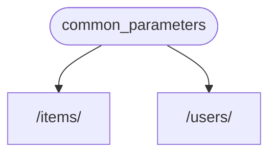
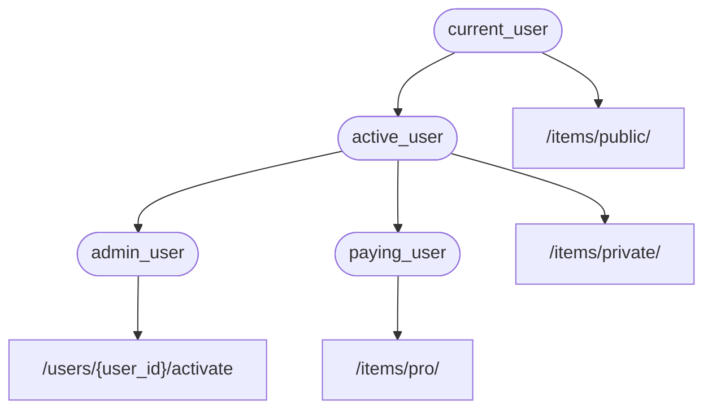

# Зависимости { #dependencies }

**FastAPI** имеет очень мощную, но интуитивную систему **<abbr title="также известно как: компоненты, ресурсы, провайдеры, сервисы, внедряемые зависимости">Инъекция зависимостей</abbr>**.

Она спроектирована так, чтобы быть очень простой в использовании и облегчать любому разработчику интеграцию других компонентов с **FastAPI**.

## Что такое инъекция зависимостей («Dependency Injection») { #what-is-dependency-injection }

В программировании **«Dependency Injection»** означает, что у вашего кода (в данном случае у ваших *функций обработки пути*) есть способ объявить вещи, которые требуются для его работы и использования: «зависимости».

И затем эта система (в нашем случае **FastAPI**) позаботится о том, чтобы сделать всё необходимое для предоставления вашему коду этих зависимостей (сделать «инъекцию» зависимостей).

Это очень полезно, когда вам нужно:

* Обеспечить общую логику (один и тот же алгоритм снова и снова).
* Разделять соединения с базой данных.
* Обеспечить безопасность, аутентификацию, требования к ролям и т. п.
* И многое другое...

Всё это при минимизации повторения кода.

## Первые шаги { #first-steps }

Давайте рассмотрим очень простой пример. Он настолько простой, что пока не очень полезен.

Но так мы сможем сосредоточиться на том, как работает система **Dependency Injection**.

### Создайте зависимость, или «dependable» (от чего что-то зависит) { #create-a-dependency-or-dependable }

Сначала сосредоточимся на зависимости.

Это просто функция, которая может принимать те же параметры, что и *функция обработки пути*:

{* ../../docs_src/dependencies/tutorial001_an_py310.py hl[8:9] *}

И всё.

**2 строки.**

И она имеет ту же форму и структуру, что и все ваши *функции обработки пути*.

Можно думать о ней как о *функции обработки пути* без «декоратора» (без `@app.get("/some-path")`).

И она может возвращать что угодно.

В этом случае эта зависимость ожидает:

* Необязательный query-параметр `q` типа `str`.
* Необязательный query-параметр `skip` типа `int`, по умолчанию `0`.
* Необязательный query-параметр `limit` типа `int`, по умолчанию `100`.

А затем просто возвращает `dict`, содержащий эти значения.

/// info | Информация

FastAPI добавил поддержку `Annotated` (и начал рекомендовать его использование) в версии 0.95.0.

Если у вас более старая версия, вы получите ошибки при попытке использовать `Annotated`.

Убедитесь, что вы [обновили версию FastAPI](../../deployment/versions.md#upgrading-the-fastapi-versions){.internal-link target=_blank} как минимум до 0.95.1, прежде чем использовать `Annotated`.

///

### Импорт `Depends` { #import-depends }

{* ../../docs_src/dependencies/tutorial001_an_py310.py hl[3] *}

### Объявите зависимость в «зависимом» { #declare-the-dependency-in-the-dependant }

Точно так же, как вы используете `Body`, `Query` и т. д. с параметрами вашей *функции обработки пути*, используйте `Depends` с новым параметром:

{* ../../docs_src/dependencies/tutorial001_an_py310.py hl[13,18] *}

Хотя вы используете `Depends` в параметрах вашей функции так же, как `Body`, `Query` и т. д., `Depends` работает немного иначе.

В `Depends` вы передаёте только один параметр.

Этот параметр должен быть чем-то вроде функции.

Вы **не вызываете её** напрямую (не добавляйте круглые скобки в конце), просто передаёте её как параметр в `Depends()`.

И эта функция принимает параметры так же, как *функции обработки пути*.

/// tip | Подсказка

В следующей главе вы увидите, какие ещё «вещи», помимо функций, можно использовать в качестве зависимостей.

///

Каждый раз, когда приходит новый запрос, **FastAPI** позаботится о:

* Вызове вашей зависимости («dependable») с корректными параметрами.
* Получении результата из вашей функции.
* Присваивании этого результата параметру в вашей *функции обработки пути*.



Таким образом, вы пишете общий код один раз, а **FastAPI** позаботится о его вызове для ваших *операций пути*.

/// check | Проверка

Обратите внимание, что вам не нужно создавать специальный класс и передавать его куда-то в **FastAPI**, чтобы «зарегистрировать» его или что-то подобное.

Вы просто передаёте его в `Depends`, и **FastAPI** знает, что делать дальше.

///

## Использование зависимости с `Annotated` в нескольких местах { #share-annotated-dependencies }

В приведённых выше примерах есть небольшое **повторение кода**.

Когда вам нужно использовать зависимость `common_parameters()`, вы должны написать весь параметр с аннотацией типа и `Depends()`:

```Python
commons: Annotated[dict, Depends(common_parameters)]
```

Но поскольку мы используем `Annotated`, мы можем сохранить это значение `Annotated` в переменную и использовать его в нескольких местах:

{* ../../docs_src/dependencies/tutorial001_02_an_py310.py hl[12,16,21] *}

/// tip | Подсказка

Это стандартный Python, это называется «type alias», и это не особенность **FastAPI**.

Но поскольку **FastAPI** основан на стандартах Python, включая `Annotated`, вы можете использовать этот трюк в своём коде. 

///

Зависимости продолжат работать как ожидалось, и **лучшая часть** в том, что **информация о типах будет сохранена**, а значит, ваш редактор кода продолжит предоставлять **автозавершение**, **встроенные ошибки** и т.д. То же относится и к другим инструментам, таким как `mypy`.

Это особенно полезно, когда вы используете это в **большой кодовой базе**, где вы используете **одни и те же зависимости** снова и снова во **многих *операциях пути***.

## Использовать `async` или не `async` { #to-async-or-not-to-async }

Поскольку зависимости также вызываются **FastAPI** (как и ваши *функции обработки пути*), применяются те же правила при определении ваших функций.

Вы можете использовать `async def` или обычное `def`.

И вы можете объявлять зависимости с `async def` внутри обычных *функций обработки пути* `def`, или зависимости `def` внутри *функций обработки пути* `async def` и т. д.

Это не важно. **FastAPI** знает, что делать.

/// note | Примечание

Если вы не уверены, посмотрите раздел [Async: *"In a hurry?"*](../../async.md#in-a-hurry){.internal-link target=_blank} о `async` и `await` в документации.

///

## Интеграция с OpenAPI { #integrated-with-openapi }

Все объявления запросов, проверки и требования ваших зависимостей (и подзависимостей) будут интегрированы в ту же схему OpenAPI.

Поэтому в интерактивной документации будет вся информация и из этих зависимостей:


## Простое использование { #simple-usage }

Если посмотреть, *функции обработки пути* объявляются для использования всякий раз, когда *путь* и *операция* совпадают, и тогда **FastAPI** заботится о вызове функции с корректными параметрами, извлекая данные из запроса.

На самом деле все (или большинство) веб-фреймворков работают таким же образом.

Вы никогда не вызываете эти функции напрямую. Их вызывает ваш фреймворк (в нашем случае **FastAPI**).

С системой **Dependency Injection** вы также можете сообщить **FastAPI**, что ваша *функция обработки пути* «зависит» от чего-то, что должно быть выполнено перед вашей *функцией обработки пути*, и **FastAPI** позаботится о его выполнении и «инъекции» результатов.

Другие распространённые термины для описания той же идеи «dependency injection»:

* ресурсы
* провайдеры
* сервисы
* внедряемые зависимости
* компоненты

## Плагины **FastAPI** { #fastapi-plug-ins }

Интеграции и «плагины» могут быть построены с использованием системы **Dependency Injection**. Но на самом деле **нет необходимости создавать «плагины»**, так как, используя зависимости, можно объявить бесконечное количество интеграций и взаимодействий, которые становятся доступными вашим *функциям обработки пути*.

И зависимости можно создавать очень простым и интуитивным способом, который позволяет просто импортировать нужные пакеты Python и интегрировать их с вашими API-функциями в пару строк кода, *буквально*.

Вы увидите примеры этого в следующих главах о реляционных и NoSQL базах данных, безопасности и т.д.

## Совместимость с **FastAPI** { #fastapi-compatibility }

Простота системы **Dependency Injection** делает **FastAPI** совместимым с:

* всеми реляционными базами данных
* NoSQL базами данных
* внешними пакетами
* внешними API
* системами аутентификации и авторизации
* системами мониторинга использования API
* системами инъекции данных в ответы
* и т.д.

## Просто и мощно { #simple-and-powerful }

Хотя иерархическая система dependency injection очень проста для определения и использования, она по-прежнему очень мощная.

Вы можете определять зависимости, которые, в свою очередь, могут иметь собственные зависимости.

В итоге строится иерархическое дерево зависимостей, и система **Dependency Injection** берёт на себя решение всех этих зависимостей (и их подзависимостей) и предоставляет (инъектирует) результаты на каждом шаге.

Например, у вас есть 4 API-эндпоинта (*операции пути*):

* `/items/public/`
* `/items/private/`
* `/users/{user_id}/activate`
* `/items/pro/`

тогда вы можете добавить разные требования к правам для каждого из них только с помощью зависимостей и подзависимостей:



## Интегрировано с **OpenAPI** { #integrated-with-openapi_1 }

Все эти зависимости, объявляя свои требования, также добавляют параметры, проверки и т.д. к вашим *операциям пути*.

**FastAPI** позаботится о добавлении всего этого в схему OpenAPI, чтобы это отображалось в системах интерактивной документации.
