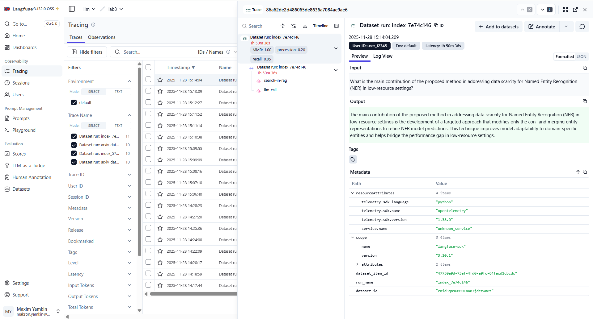
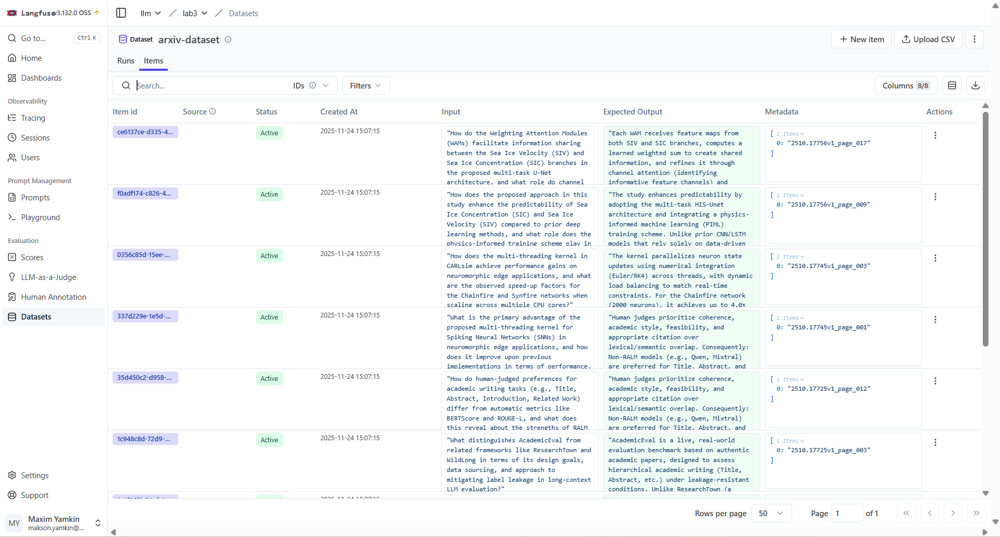
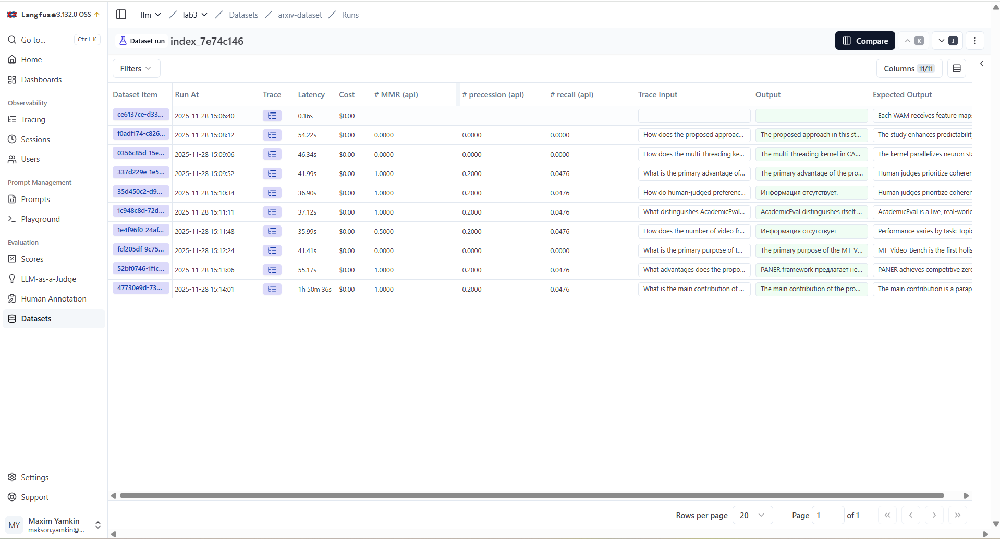
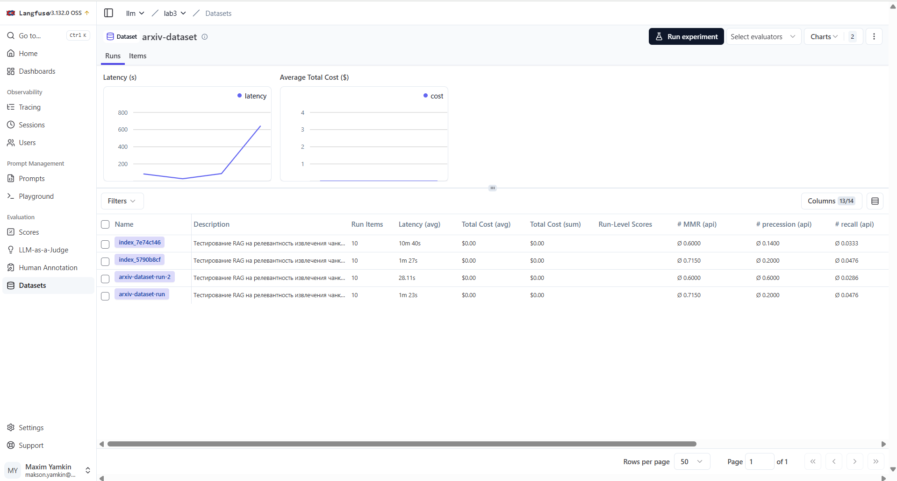

# Лабораторная работа №3

## Описание задания

В рамках третьей лабораторной работы необходимо равзернуть локально Langfuse и подключить логгирование метрик и результатов работы к 1 или 2 лабораторной работе.

## Использованные технологии и модели

- LLM: qwen2.5:3b.
- Библиотеки: langfuse, faiss, sentence_transformers, openai.

## Результаты работы

Сначала был локально развернут Langfuse и была проведена авторизация. Был создан проект. После чего к RAG был подклчючен Langfuse с помощью контекстного менеджера. После чего был из кода создан датасет с примерами вопросов в RAG. И была настроена оценка прогона данного датасета и логгирования результатов прогона в LangFuse.

Была настроена трассировка. 

В рамках одного следа есть два generation объекта - earch-in-rag (поиск в RAG) и llm-call (вызов llm).

После чего был создан датасет.

Далее был настроен запуск эксперимента по данному датасету.

## Выводы

Langfuse помогает корректно и быстро отслеживать работу llm-пайплайна и при этом эффектино проводить эксперименты по поиску наилучших параметров. Так, наилучшим индексом из RAG систем является index_5790b8cf. При этом удобное логгирование всех результатов позволяет находить слабые места в построенном RAG и улучшать его.

## Инструкция по запуску
1. Установить зависимости: `pip install -r requirements.txt`
2. Положить в папку artifacts index из прошлой лабораторной работы.
3. Склонировать репозиторий langfuse `git clone https://github.com/langfuse/langfuse.git`
4. Перейти в папку `cd langfuse`
5. Запустить langfuse локально `docker compose up`
6. Взять из интерфейса ключи Langfuse и положить их в файл soucre/.env "LANGFUSE_PUBLIC_KEY", "LANGFUSE_SECRET_KEY", "LANGFUSE_HOST"
7. Запустить скрипт: `python source/rag_pipline.py` для запуска RAG пайплайна и тестирования задавания вопроса
8. Запустить скрипт `python source/cerate_dataset.py` для создания датасета
9. Запустить скрипт `python source/log_metric.py` для прогона RAG по датасету